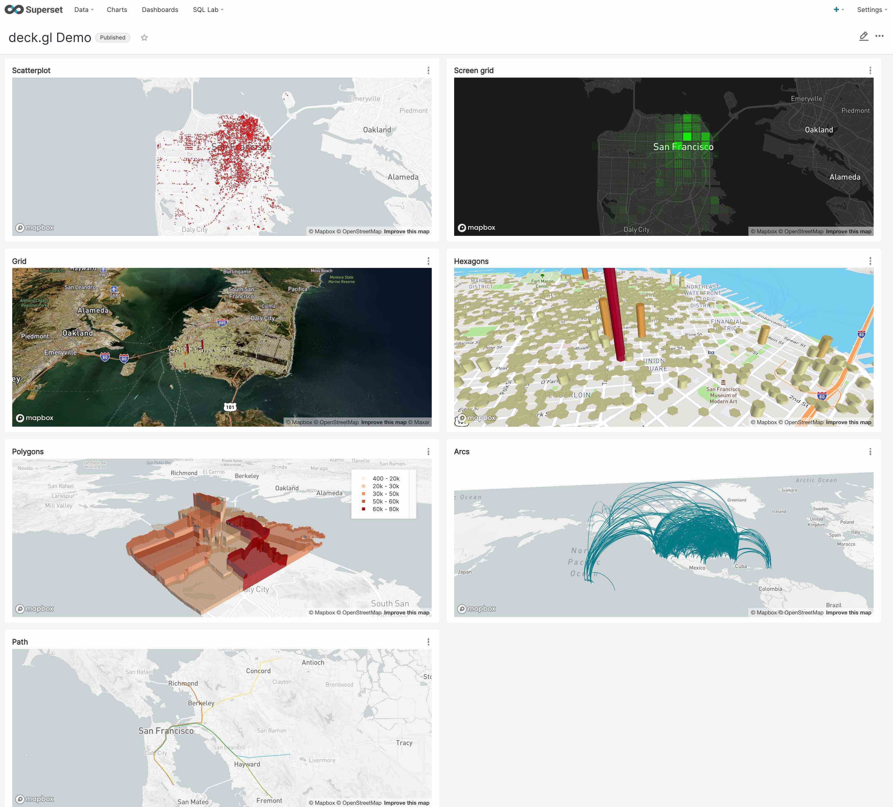
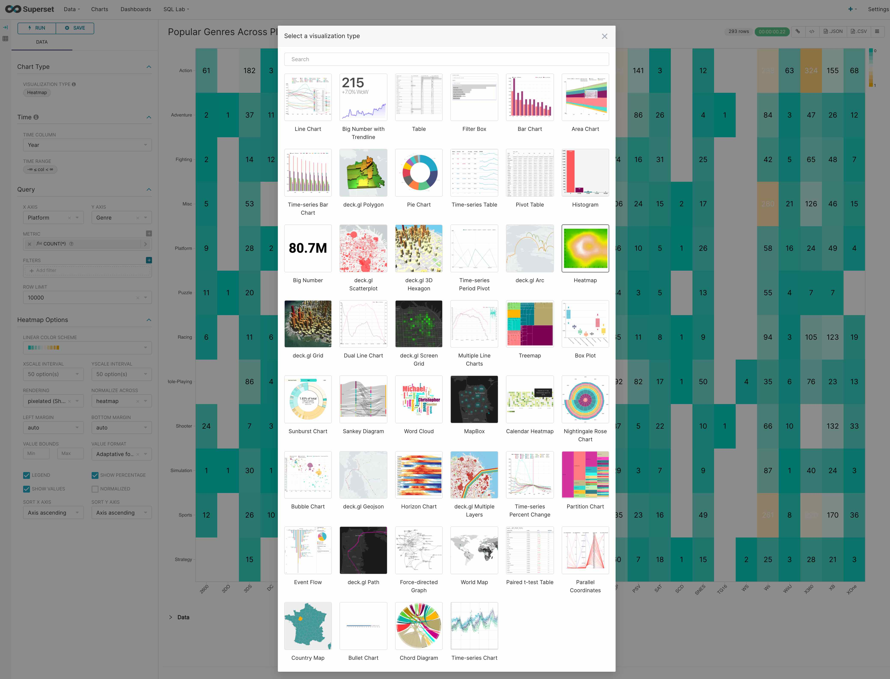
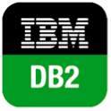

# Rabbitai

A modern, enterprise-ready business intelligence web application.

[**Why Rabbitai?**](#why-rabbitai) |
[**Supported Databases**](#supported-databases) |
[**Installation and Configuration**](#installation-and-configuration) |
[**Release Notes**](RELEASING/README.md#release-notes-for-recent-releases) |
[**Get Involved**](#get-involved) |
[**Contributor Guide**](#contributor-guide) |
[**Resources**](#resources) |
[**Organizations Using Rabbitai**](RESOURCES/INTHEWILD.md)

## Screenshots & Gifs

**Gallery**

<kbd></kbd> 

**View Dashboards**

<kbd></kbd> 

**Slice & dice your data**

<kbd></kbd> 

**Query and visualize your data with SQL Lab**

<kbd></kbd> 

**Visualize geospatial data with deck.gl**

<kbd></kbd> 

**Choose from a wide array of visualizations**

<kbd></kbd> 

## Why Rabbitai?

Rabbitai provides:

- An intuitive interface for visualizing datasets and
  crafting interactive dashboards
- A wide array of beautiful visualizations to showcase your data
- Code-free visualization builder to extract and present datasets
- A world-class SQL IDE for preparing data for visualization, including a rich metadata browser
- A lightweight semantic layer which empowers data analysts to quickly define custom dimensions and metrics
- Out-of-the-box support for most SQL-speaking databases
- Seamless, in-memory asynchronous caching and queries
- An extensible security model that allows configuration of very intricate rules
  on who can access which product features and datasets.
- Integration with major
  authentication backends (database, OpenID, LDAP, OAuth, REMOTE_USER, etc)
- The ability to add custom visualization plugins
- An API for programmatic customization
- A cloud-native architecture designed from the ground up for scale

## Supported Databases

Rabbitai can query data from any SQL-speaking datastore or data engine (e.g. Presto or Athena) that has a Python DB-API driver and a SQLAlchemy dialect.

Here are some of the major database solutions that are supported:

  
  
  
  
  
  
  
  
  
  
  
  
  
  
  
  
  
  
  
  
  
  

**A more comprehensive list of supported databases** along with the configuration instructions can be found
[here](https://rabbitai.apache.org/docs/databases/installing-database-drivers).

Want to add support for your datastore or data engine? Read more [here](https://rabbitai.apache.org/docs/frequently-asked-questions#does-rabbitai-work-with-insert-database-engine-here) about the technical requirements.

## Installation and Configuration

[Extended documentation for Rabbitai](https://rabbitai.apache.org/docs/installation/installing-rabbitai-using-docker-compose)

## Get Involved

- Ask and answer questions on [StackOverflow](https://stackoverflow.com/questions/tagged/apache-rabbitai) using the **apache-rabbitai** tag
- [Join our community's Slack](https://join.slack.com/t/apache-rabbitai/shared_invite/zt-l5f5e0av-fyYu8tlfdqbMdz_sPLwUqQ)
  and please read our [Slack Community Guidelines](https://github.com/apache/rabbitai/blob/master/CODE_OF_CONDUCT.md#slack-community-guidelines)
- [Join our dev@rabbitai.apache.org Mailing list](https://lists.apache.org/list.html?dev@rabbitai.apache.org)

## Contributor Guide

Interested in contributing? Check out our
[CONTRIBUTING.md](https://github.com/apache/rabbitai/blob/master/CONTRIBUTING.md)
to find resources around contributing along with a detailed guide on
how to set up a development environment.

## Resources

- Rabbitai 1.0
  - [Rabbitai 1.0 Milestone](https://rabbitai.apache.org/docs/version-one)
  - [Rabbitai 1.0 Release Notes](https://github.com/apache/rabbitai/tree/master/RELEASING/release-notes-1-0)
- Getting Started with Rabbitai
  - [Rabbitai in 2 Minutes using Docker Compose](https://rabbitai.apache.org/docs/installation/installing-rabbitai-using-docker-compose#installing-rabbitai-locally-using-docker-compose)
  - [Installing Database Drivers](https://rabbitai.apache.org/docs/databases/dockeradddrivers)
  - [Building New Database Connectors](https://preset.io/blog/building-database-connector/)
  - [Create Your First Dashboard](https://rabbitai.apache.org/docs/creating-charts-dashboards/first-dashboard)
- [Documentation for Rabbitai End-Users (by Preset)](https://docs.preset.io/docs/terminology)
- Deploying Rabbitai
  - [Official Docker image](https://hub.docker.com/r/apache/rabbitai)
  - [Helm Chart](https://github.com/apache/rabbitai/tree/master/helm/rabbitai)
- [Recordings of Past Community Events](https://www.youtube.com/channel/UCMuwrvBsg_jjI2gLcm04R0g)
  - [Meetup: Rabbitai 1.0](https://www.youtube.com/watch?v=gEZkFF2kokk)
  - [Live Demo: Interactive Time-series Analysis with Druid and Rabbitai](https://www.youtube.com/watch?v=4eh7OTfMln8)
  - [Live Demo: Visualizing MongoDB and Pinot Data using Trino](https://www.youtube.com/watch?v=Dw_al_26F6o)
- Upcoming Rabbitai Events
  - [Rabbitai + Star Wars: May the 4th Be With You](https://preset.io/events/2021-05-04-rabbitai-star-wars-may-the-4th-be-with-you)
  - [Meetup - Developing and Deploying Custom Visualization Plugins in Rabbitai](https://www.meetup.com/Global-Apache-Rabbitai-Community-Meetup/events/277835486/)
  - [Visualize Your Data Lake Using Athena and Rabbitai](https://preset.io/events/2021-05-18-visualize-your-data-lake-using-athena-and-rabbitai)
- Visualizations
  - [Building Custom Viz Plugins](https://rabbitai.apache.org/docs/installation/building-custom-viz-plugins)
  - [Managing and Deploying Custom Viz Plugins](https://medium.com/nmc-techblog/apache-rabbitai-manage-custom-viz-plugins-in-production-9fde1a708e55)
  - [Why Apache Rabbitai is Betting on Apache ECharts](https://preset.io/blog/2021-4-1-why-echarts/)
- [Rabbitai API](https://rabbitai.apache.org/docs/rest-api)
